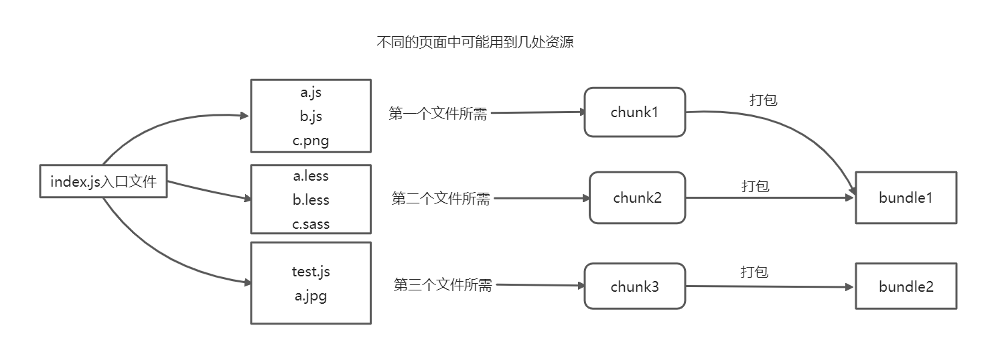
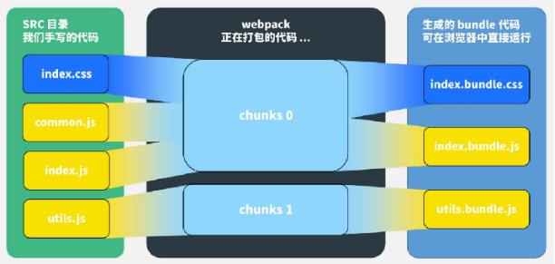
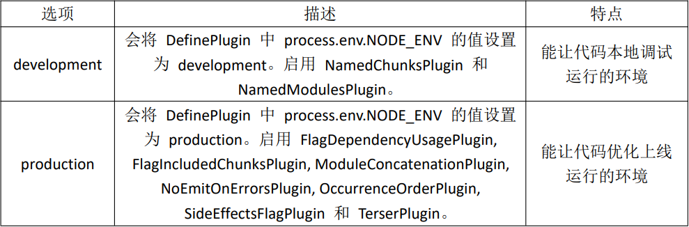

## **1. webpack 打包概括**






## 2. webpack 的5个核心概念

#### **Entry入口**

**
```
指示webpack以哪个文件为入口起点开始打包，分析构建内部依赖图。
```

**

#### **Output输出**

**
```
指示webpack打包后的资源bundles输出到哪里去，以及如何命名。
```

**

#### **Loader**

**
```
让webpack能够去处理那些非JavaScript文件(webpack自身只理解JavaScript)。
```

**

#### **Plugins插件**

**
```
可以用于执行范围更广的任务。插件的范围包括，从打包优化和压缩，一直到重新定义环境中的变量等。
```

**

#### **Mode模式**

**
```
指示webpack使用相应模式的配置。
```

**


